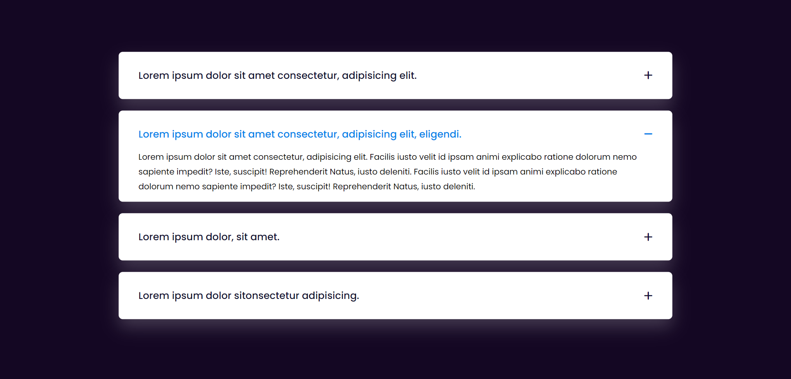

# Modern Accordion

Welcome to the Modern Accordion repository! This project is a JavaScript-based web application that implements an accordion interface for showcasing information. Built with HTML, CSS, and JavaScript, it features a modern UI design for an interactive and visually appealing user experience.

## Preview



## Features

- **Accordion Interface:** Display content in a collapsible and expandable format for easy navigation.
- **Modern UI Design:** Sleek layout and visually appealing design for an enjoyable user interface.
- **Customizable:** Easily customize the content and styles to suit your preferences.

## Getting Started

To run the Modern Accordion locally, follow these steps:

1. Clone the repository to your local machine:

   ```bash
   git clone https://github.com/Devsethi3/Modern-Accordion.git
   ```

2. Open the `index.html` file in your preferred web browser.

## Usage

1. Click on the accordion headers to expand or collapse the content.
2. Customize the content in the HTML file to include your information.

## Customization

Feel free to customize this project to fit your preferences. You can modify the design, add more sections, or integrate additional functionalities. Adjust the content and styles in the HTML and CSS files.

## Contributing

If you'd like to contribute to this project, follow these steps:

1. Fork the repository.
2. Create a new branch for your feature or improvement.
3. Make your changes and commit them with descriptive messages.
4. Push your changes to your forked repository.
5. Open a pull request to merge your changes into the main branch.

## License

Explore the Modern Accordion, create interactive interfaces, and consider contributing to its development. Thank you for checking out the repository!